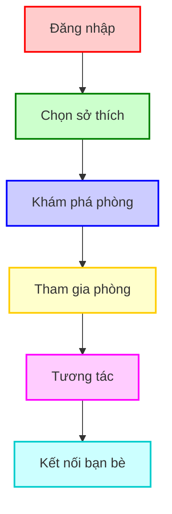
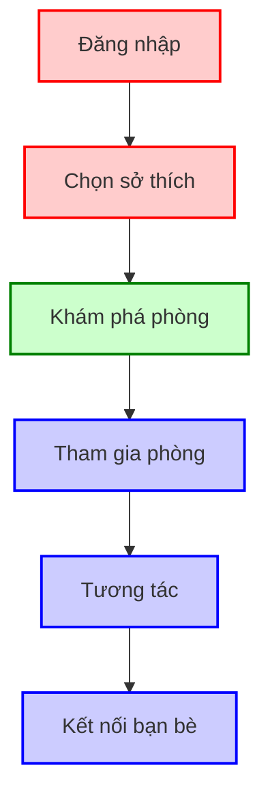
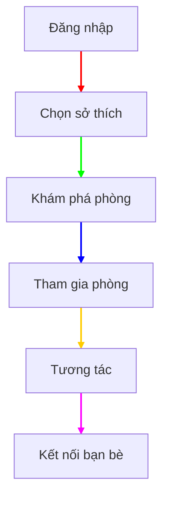

Để làm sơ đồ Mermaid có màu sắc phong phú hơn, bạn có thể sử dụng các thuộc tính tuỳ chỉnh như style và classDef để điều chỉnh màu sắc và kiểu dáng của các nút và liên kết trong sơ đồ. Dưới đây là cách thực hiện:

# Cách đổi màu sắc trong Mermaid
__1. Sử dụng style__
Bạn có thể áp dụng màu sắc riêng cho từng node bằng cách dùng style trong Mermaid:

```typescript



__2. Sử dụng classDef và class__
Nếu bạn có nhiều node cần cùng một kiểu màu, sử dụng classDef để định nghĩa lớp và áp dụng bằng class.

```typescript



__3. Đổi màu liên kết (Edge)__
Bạn có thể thay đổi màu sắc và kiểu dáng của liên kết bằng cách sử dụng linkStyle.

```typescript



__Lưu ý__
- Sử dụng mã màu HEX hoặc RGB cho màu sắc (VD: #ffcccc hoặc rgb(255,204,204)).
- Các thuộc tính bạn có thể tuỳ chỉnh:
    - __fill__: Màu nền của node.
    - __stroke__: Màu viền của node.
    - __stroke-width__: Độ dày của viền.
- Để xem trước hiệu ứng, bạn nên sử dụng Mermaid Live Editor hoặc VS Code với plugin hỗ trợ.
- Nhấn tổ hợp phím Ctrl + Shift + V để xem
